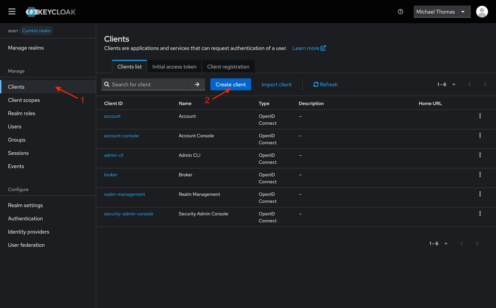
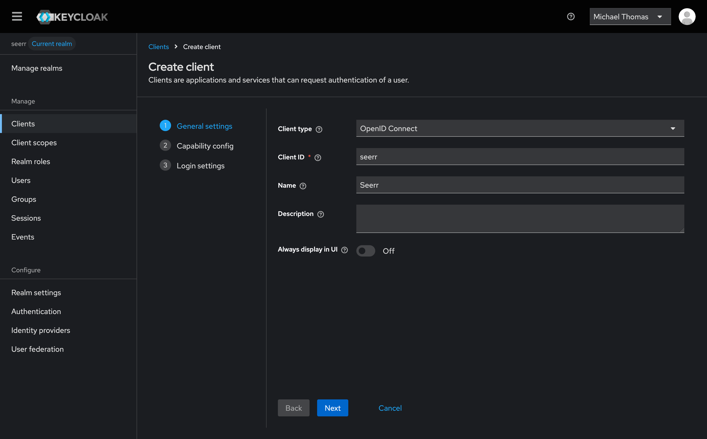
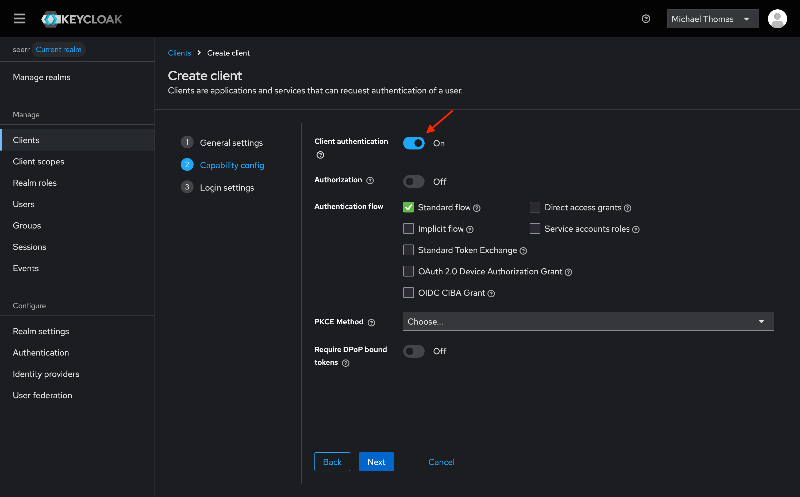
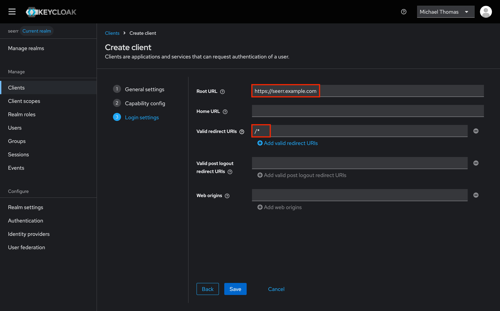
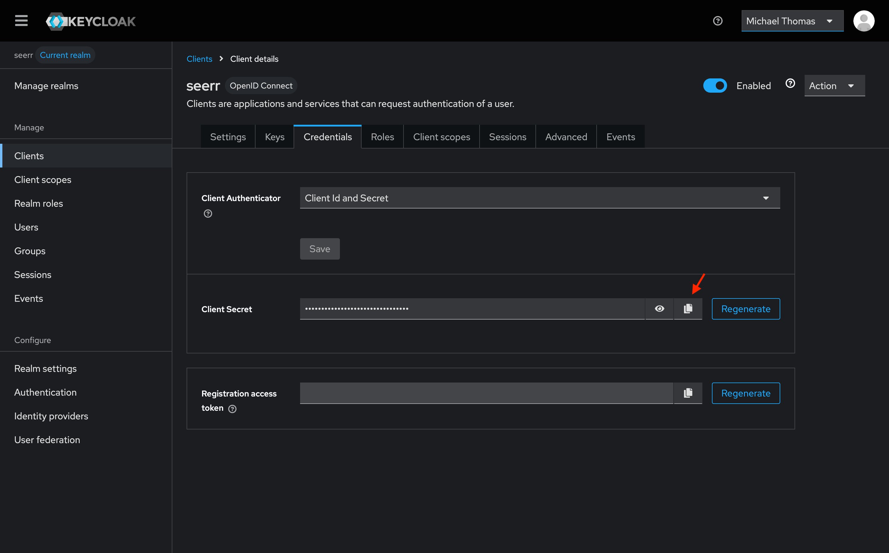

# OpenID Connect

Seerr supports OpenID Connect (OIDC) for authentication and authorization. To begin setting up OpenID Connect, follow these steps:

1. First, enable OpenID Connect [on the User settings page](./index.md#enable-openid-connect-sign-in).
2. Once enabled, access OpenID Connect settings using the cog icon to the right.
3. Add a new provider by clicking the "Add Provider" button.
4. Configure the provider with the options described below.
5. Link your OpenID Connect account to your Seerr account using the "Link Account" button on the Linked Accounts page in your user's settings.
6. Finally, you should be able to log in using your OpenID Connect account.

## Configuration Options

### Provider Name

Name of the provider which appears on the login screen.

Configuring this setting will automatically determine the [provider slug](#provider-slug), unless it is manually specified.

### Logo

The logo to display for the provider. Should be a URL or base64 encoded image.

:::tip

The search icon at the right of the logo field opens the [selfh.st/icons](https://selfh.st/icons) database. These icons include popular self-hosted OpenID Connect providers.

:::

### Issuer URL
The base URL of the identity provider's OpenID Connect endpoint

### Client ID

The Client ID assigned to Seerr

### Client Secret

The Client Secret assigned to Seerr

### Provider Slug

Unique identifier for the provider

### Scopes

Space-separated list of scopes to request from the provider

### Required Claims

Space-separated list of boolean claims that are required to log in

### Allow New Users

Create accounts for new users logging in with this provider

## Provider Setup

Most OpenID Connect providers follow the same basic setup pattern:

1. **Create a new client/application** in your identity provider using the OAuth 2.0 / OpenID Connect protocol.
2. **Set the client type to confidential** (as opposed to public) so that a client secret is issued.
3. **Add redirect URIs** pointing to your Seerr instance. At minimum, allow:
   - `https://<your-seerr-url>/login`
   - `https://<your-seerr-url>/profile/settings/linked-accounts`
4. **Copy the Client ID and Client Secret** from your provider and enter them in Seerr's provider configuration.
5. **Set the Issuer URL** to the base URL of your provider's OpenID Connect discovery endpoint. Most providers publish a `/.well-known/openid-configuration` document — the Issuer URL is the part before that path.

The default scopes (`openid profile email`) are sufficient for most providers. Only adjust scopes or required claims if your provider requires it.

## Provider Guides

### Keycloak

To set up Keycloak, follow these steps:

1. First, create a new client in Keycloak.
  

1. Set the client ID to `seerr`, and set the name to "Seerr" (or whatever you prefer).
  

1. Next, be sure to enable "Client authentication" in the capabilities section. The remaining defaults should be fine. 
  

1. Finally, set the root url to your Seerr instance's URL, and a wildcard `/*` as a valid redirect URL.
  

1. With all that set up, you should be able to configure Seerr to use Keycloak for authentication. Be sure to copy the client secret from the credentials page, as shown above. The issuer URL can be obtained from the "Realm Settings" page, by copying the link titled "OpenID Endpoint Configuration".
  

1. Use `https://<keycloak-url>/realms/<realm>/` as the Issuer URL, replacing `<realm>` with your Keycloak realm name.
